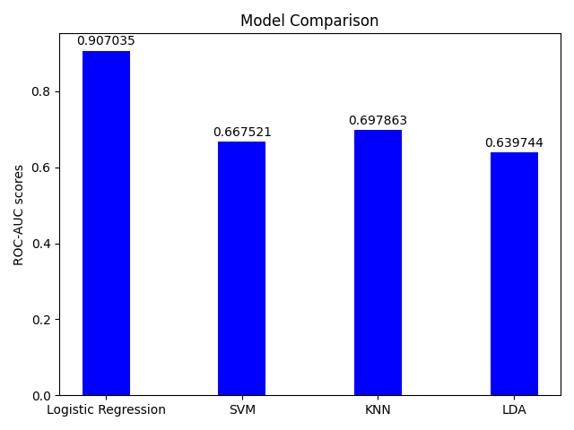

# Pneumonia Detection from Chest X-Ray Images

This project aims to build a machine learning model for detecting pneumonia from chest X-ray images. This is a binary classification problem, where the two classes are 'NORMAL' (no pneumonia) and 'PNEUMONIA' (pneumonia present).

## Dataset

The dataset used in this project consists of 5,863 X-Ray images (JPEG) and 2 categories: Pneumonia/Normal. It's organized into three folders (train, test, val) and contains subfolders for each image category. There are 5,216 X-Ray images in the training set, 624 in the testing set, and 16 images in the validation set.

## Normal example


## Pnemonia example


## Launch the project
Make sure you have already installed **docker** and **docker-compose**

```console
foo@bar:~$ docker-compose up --build
```

## Models Used

1. **Logistic Regression**: Logistic regression is a statistical model that in its basic form uses a logistic function to model a binary dependent variable.

2. **Support Vector Machine (SVM)**: In machine learning, support-vector machines are supervised learning models with associated learning algorithms that analyze data used for classification and regression analysis.

3. **K-Nearest Neighbors (KNN)**: k-NN is a type of instance-based learning, or lazy learning, where the function is only approximated locally and all computation is deferred until function evaluation.

4. **Linear Discriminant Analysis (LDA)**: LDA is a generalization of Fisher's linear discriminant, a method used in statistics, pattern recognition, and machine learning to find a linear combination of features that characterizes or separates two or more classes of objects or events.

Each model was implemented using the Scikit-learn library in Python.

## Metrics Used

We used two main metrics to evaluate the performance of our models:

1. **ROC-AUC Score**: The ROC-AUC Score is the receiver operating characteristic area under the curve. It provides an aggregate measure of performance across all possible classification thresholds.

2. **F1-Score**: The F1 score is the harmonic mean of the precision and recall, where an F1 score reaches its best value at 1 (perfect precision and recall) and worst at 0.

## Results

The models performed as follows:

1. **Logistic Regression**: ROC-AUC Score: 0.911, F1-Score: 0.836
2. **SVM**: ROC-AUC Score: 0.694, F1-Score: 0.839
3. **KNN**: ROC-AUC Score: 0.714, F1-Score: 0.851
4. **LDA**: ROC-AUC Score: 0.595, F1-Score: 0.701

Based on the results, here are some potential conclusions:

1. **Logistic Regression**: Your logistic regression model performed well, achieving the highest ROC-AUC score (0.911) among the four models. This means it did a good job at distinguishing between the two classes (Pneumonia and Normal). The F1-score of 0.836 is also quite good, indicating that it achieved a good balance between precision (how many of the positively predicted cases actually had pneumonia) and recall (how many of the actual pneumonia cases it managed to catch).

2. **SVM**: The SVM model had the second highest F1-score (0.839), indicating a good balance between precision and recall, similar to the logistic regression model. However, its ROC-AUC score was significantly lower (0.694), suggesting that it wasn't as good as the logistic regression model at ranking instances of the two classes.

3. **KNN**: The KNN model achieved the highest F1-score (0.851), indicating it had the best balance between precision and recall among the four models. However, its ROC-AUC score was only 0.714, suggesting that, while it did well on the instances it predicted with high confidence, it struggled more with instances it was less sure about.

4. **LDA**: The LDA model had the lowest scores on both metrics. This suggests that it struggled both with ranking instances of the two classes (as indicated by the low ROC-AUC score of 0.595) and with achieving a balance between precision and recall (as indicated by the low F1-score of 0.701).




These images above compare the F1-Score and ROC-AUC score for all the models we have used.

In summary, while all of our models performed reasonably well, the logistic regression model was the best at distinguishing between the two classes, and the KNN model was the best at achieving a balance between precision and recall. However, it's worth noting that the actual best model for a given problem can depend on a variety of factors, including the specific requirements of the task at hand (e.g., whether it's more important to catch all cases of pneumonia, even at the risk of some false positives, or to be absolutely sure about the cases it flags as pneumonia).


Thank you


<p align="center">
  <div class="footer">
            &copy; Made with :heart: by me
        </div>
</p>
